class: inverse, center, middle
name: welcome

```{css, echo=FALSE} 
@media print { # print out incremental slides; see https://stackoverflow.com/questions/56373198/get-xaringan-incremental-animations-to-print-to-pdf/56374619#56374619
  .has-continuation {
    display: block !important;
  }
}
```

```{r setup, include=FALSE}
# figures formatting setup
options(htmltools.dir.version = FALSE)
library(knitr)
opts_chunk$set(
  prompt = T,
  fig.align="center", #fig.width=6, fig.height=4.5, 
  # out.width="748px", #out.length="520.75px",
  dpi=300, #fig.path='Figs/',
  cache=T, #echo=F, warning=F, message=F
  engine.opts = list(bash = "-l")
  )

## Next hook based on this SO answer: https://stackoverflow.com/a/39025054
knit_hooks$set(
  prompt = function(before, options, envir) {
    options(
      prompt = if (options$engine %in% c('sh','bash')) '$ ' else 'R> ',
      continue = if (options$engine %in% c('sh','bash')) '$ ' else '+ '
      )
})

library(tidyverse)
library(hrbrthemes)
library(fontawesome)
```


# Welcome!
<html><div style='float:left'></div><hr color='#EB811B' size=1px style="width:1000px; margin:auto;"/></html>

---

# Introductions

### Course

`r fa('globe')` https://github.com/intro-to-data-science-24

Much of this course lives on GitHub. You will find lecture materials, code, assignments, and other people's presentations there. We also have Moodle, which is is for everything else.

--

### Me

`r fa('address-book')` I'm [Simon Munzert](https://simonmunzert.github.io/) [si’mən munsɜrt], or just Simon [saɪmən].

`r fa('envelope')` [munzert@hertie-school.org](mailto:munzert@hertie-school.org)

`r fa('graduation-cap')` Professor of Data Science and Public Policy | Director of the Data Science Lab

--

### You

What's your name? And would you share a fun fact about yourself?

---

# More about you

<div align="center">
<br>

</div>


---

# More about you

.pull-left[
<div align="center">
<br><b>MPP/MIA/PhD</b>
<br>
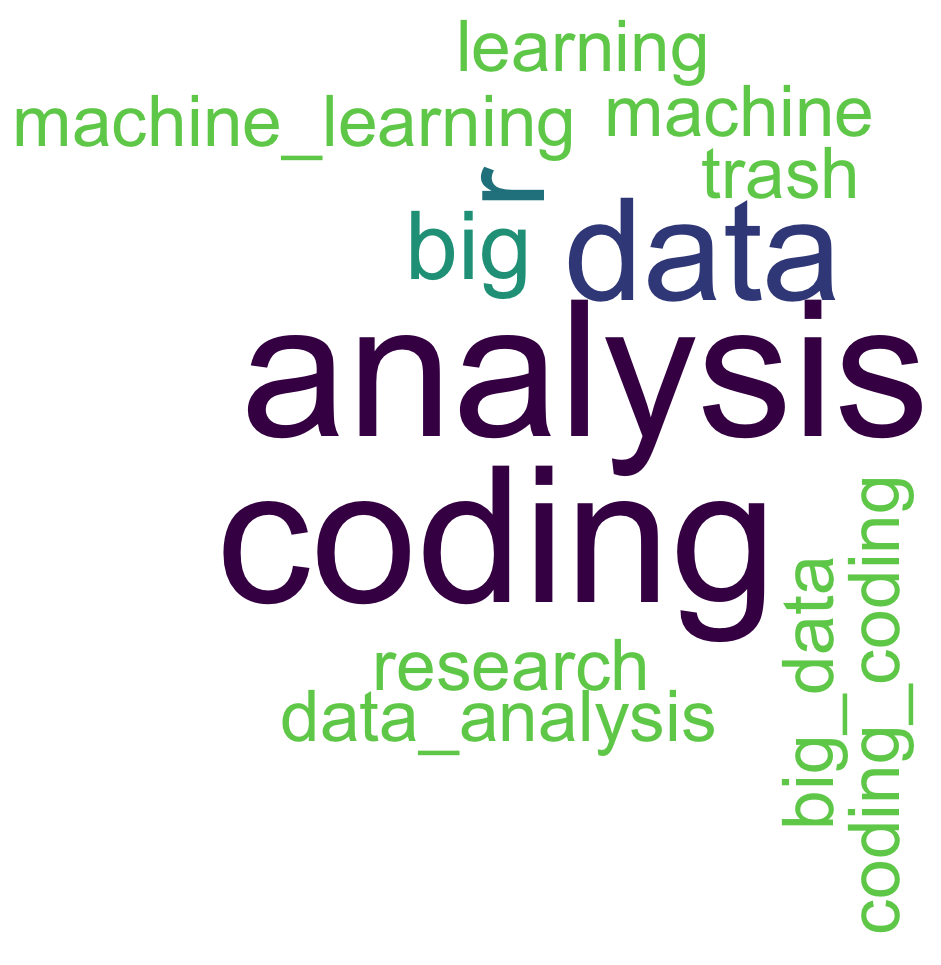
</div>
]

.pull-right[
<div align="center">
<br><b>MDS</b>
<br>
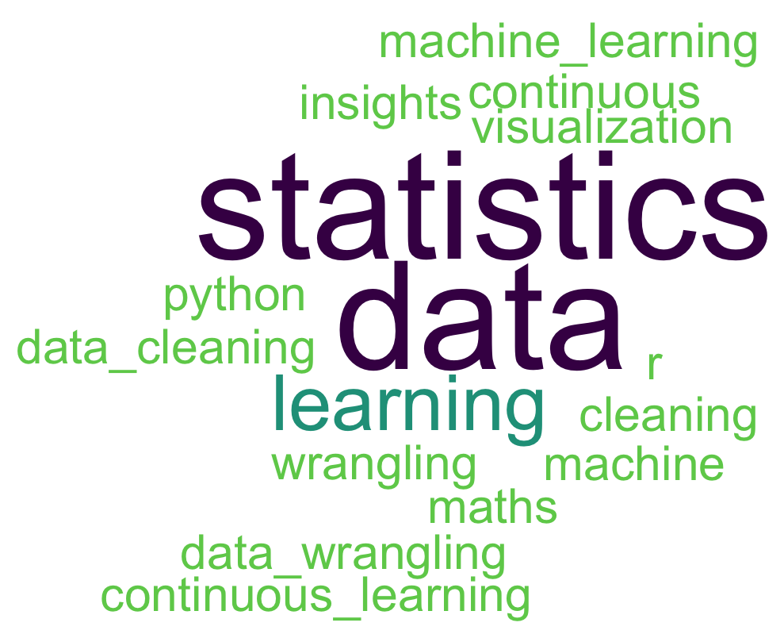
</div>
]

---

# More about you

.pull-left[
<div align="center">
<br><b>MPP/MIA/PhD</b>
<br>
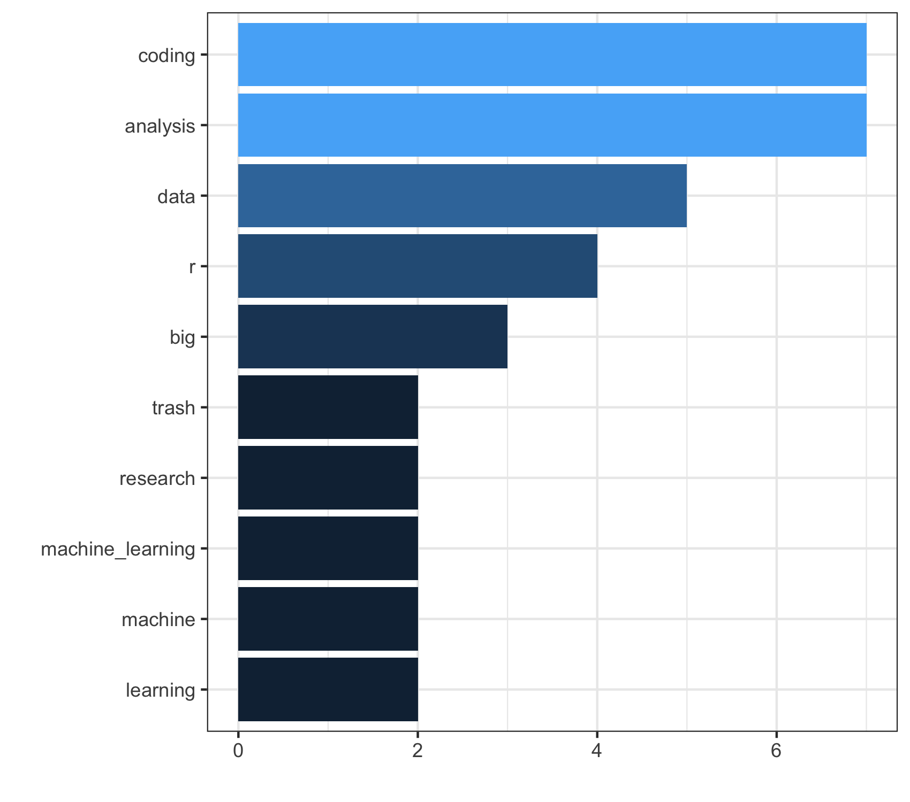
</div>
]

.pull-right[
<div align="center">
<br><b>MDS</b>
<br>
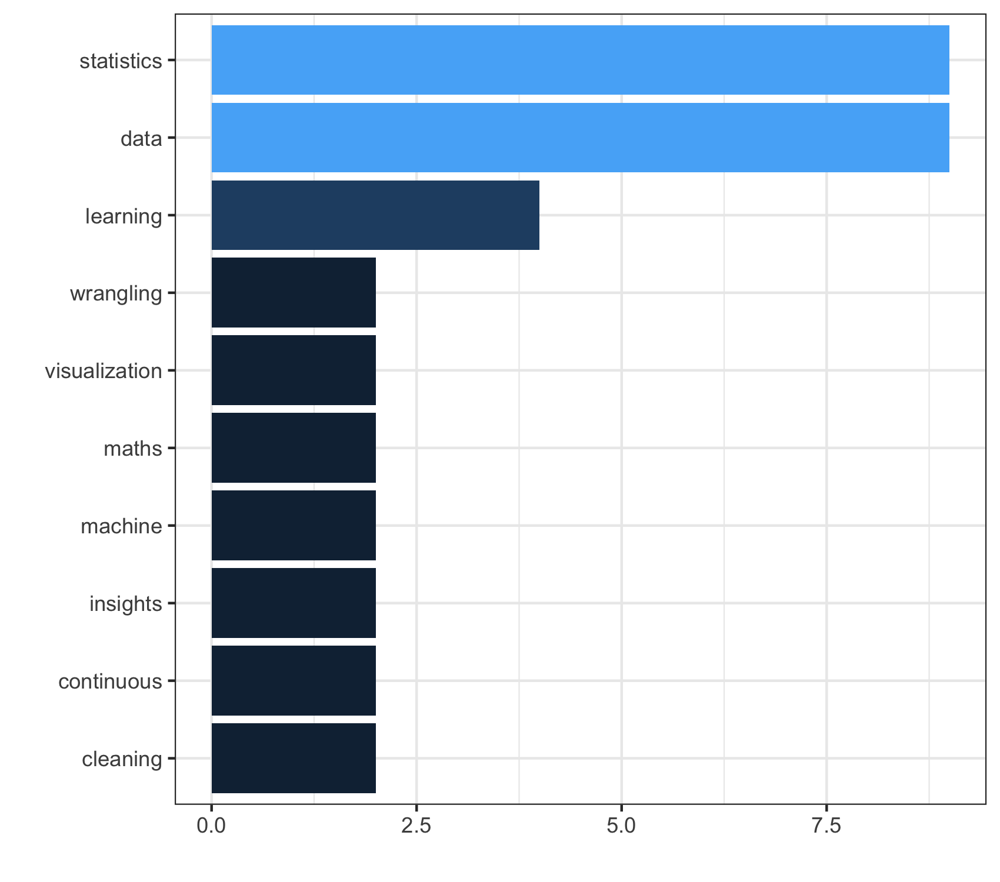
</div>
]


---

# The labs

.pull-left-wide[

## Who & how

- This course is accompanied by labs administered by **Carmen Garro** and **Sebastian Ramirez Ruiz**.
- The labs are mandatory (MDS) / optional (the rest). Please attend them in any case.
- As with the regular classes, please stick to the lab you are assigned to.

## What for

- What these sessions are meant for:
  - Applying tools in practice
  - Discussion of issues related to the assignments
  - Boosting your R skills
- What these sessions are **not** meant for: 
  - Solving the assignments for you
  - Taking care of developing your coding skills
]

.pull-right-small-center[
<div align="center">
<br>

<br>
<br>

</div>
]


---

# Class etiquette

.pull-left-wide[
<br>

- Learning how to code can be challenging and might lead you out of your comfort zone. If you have problems with the pace of the course, let me and the TAs know. I expect your commitment to the class, but **I do not want anyone to fail.**
- You are all genuinely interested in data science. But there is also considerable variation in your backgrounds. This is how we like it! Some sessions will be more informative for you than others. If you feel bored, **look out for and help others**, or explore other corners of R you don't know yet.
- **Be respectful** to each other, all the time. This includes the TAs and me.
- **Ask questions** whenever you feel the need to do so!
]

.pull-right-small-center[
<div align="center">
<br><br>

</div>
]

---

# Table of contents

</br></br>

1. [Welcome!](#welcome)

2. [What is data science?](#whatisdatascience)

3. [(Data) science for public policy](#datasciencepublicpolicy)

4. [Class logistics](#logistics)


---
class: inverse, center, middle
name: whatisdatascience

# What is data science?
<html><div style='float:left'></div><hr color='#EB811B' size=1px style="width:1000px; margin:auto;"/></html>


---
# What is data science?

.pull-left[
## What is data science?

> "Data science is an interdisciplinary academic field that uses statistics, scientific computing, scientific methods, processes, algorithms and systems to extract or extrapolate knowledge and insights from potentially noisy, structured, or unstructured data." - [Wikipedia](https://en.wikipedia.org/wiki/Data_science)

> "Data science is a concept to unify statistics, data analysis, informatics, and their related methods to understand and analyze actual phenomena with data." - [Chikio Hayashi](https://www.springer.com/book/9784431702085)

Overall, there's **no consensus** - it is a buzzword after all. We're going to carry on with Conway's working definition.
]

.pull-right[
## A working definition

<div align="center"><br>
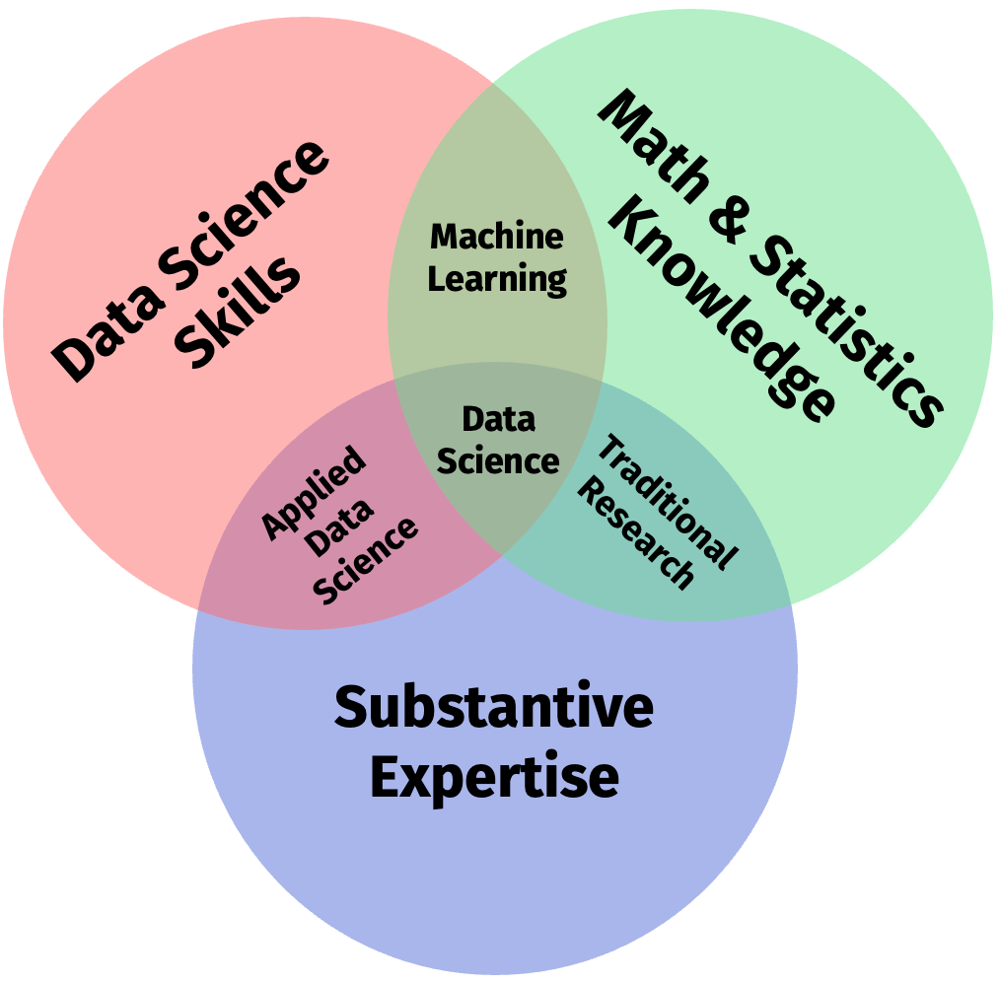
</div>

`Source` [Drew Conway, 2010](https://drewconway.com/zia/2013/3/26/the-data-science-venn-diagram) (adapted)
]


---

# The data science pipeline

.pull-left[

## Preparatory work

- **Problem definition** predict, infer, describe
- **Design** conceptualize, build data collection device
- **Data collection** recruit, collect, monitor

]

---

# The data science pipeline

.pull-left[

## Preparatory work

- **Problem definition** predict, infer, describe
- **Design** conceptualize, build data collection device
- **Data collection** recruit, collect, monitor

## Data operation

]

.pull-right-center[
<br><br><br>
<div align="center">

</div>
]

---

# The data science pipeline

.pull-left[

## Preparatory work

  - **Problem definition** predict, infer, describe
  - **Design** conceptualize, build data collection device
  - **Data collection** recruit, collect, monitor

## Data operation

   - **Wrangle**: import, tidy, manipulate
   
]

.pull-right-center[
<br><br><br>
<div align="center">

</div>
]


---

# The data science pipeline

.pull-left[

## Preparatory work

  - **Problem definition** predict, infer, describe
  - **Design** conceptualize, build data collection device
  - **Data collection** recruit, collect, monitor

## Data operation

   - **Wrangle**: import, tidy, manipulate
   - **Explore**: visualize, describe, discover


]

.pull-right-center[
<br><br><br>
<div align="center">

</div>
]


---

# The data science pipeline

.pull-left[

## Preparatory work

  - **Problem definition** predict, infer, describe
  - **Design** conceptualize, build data collection device
  - **Data collection** recruit, collect, monitor

## Data operation

   - **Wrangle**: import, tidy, manipulate
   - **Explore**: visualize, describe, discover
   - **Model**: build, test, infer, predict


]

.pull-right-center[
<br><br><br>
<div align="center">

</div>
]


---

# The data science pipeline

.pull-left[

## Preparatory work

  - **Problem definition** predict, infer, describe
  - **Design** conceptualize, build data collection device
  - **Data collection** recruit, collect, monitor

## Data operation

   - **Wrangle**: import, tidy, manipulate
   - **Explore**: visualize, describe, discover
   - **Model**: build, test, infer, predict

## Dissemination

  - **Communicate**: to the public, media, policymakers
  - **Publish**: journals/proceedings, blogs, software
  - **Productize**: make usable, robust, scalable


]

.pull-right-center[
<br><br><br>
<div align="center">

</div>
]


---

# The data science pipeline

.pull-left[

## Preparatory work

  - **Problem definition** predict, infer, describe
  - **Design** conceptualize, build data collection device
  - **Data collection** recruit, collect, monitor

## Data operation

   - **Wrangle**: import, tidy, manipulate
   - **Explore**: visualize, describe, discover
   - **Model**: build, test, infer, predict

## Dissemination

  - **Communicate**: to the public, media, policymakers
  - **Publish**: journals/proceedings, blogs, software
  - **Productize**: make usable, robust, scalable

**Meta skill: programming**

]

.pull-right-center[
<br><br><br>
<div align="center">

</div>
]


---

# The data science pipeline

.pull-left[

## Preparatory work

  - **Problem definition** predict, infer, describe
  - **Design** conceptualize, build data collection device
  - **Data collection** recruit, collect, monitor

## Data operation

   - **Wrangle**: import, tidy, manipulate
   - **Explore**: visualize, describe, discover
   - **Model**: build, test, infer, predict

## Dissemination

  - **Communicate**: to the public, media, policymakers
  - **Publish**: journals/proceedings, blogs, software
  - **Productize**: make usable, robust, scalable

**Meta skill: programming with R**
]

.pull-right-center[
<br><br>
<div align="center">

</div>
]


---
class: inverse, center, middle
name: datasciencepublicpolicy

# (Data) science for public policy

<html><div style='float:left'></div><hr color='#EB811B' size=1px style="width:1000px; margin:auto;"/></html>


---
# Types of data-driven research and their role for policy

.pull-left-small2[
## 1. Description
- What is the state of the world?
- What are the trends over time?
- What are the differences between groups?

## The value for policy-making
- At the center of **monitoring**
- "How many people consume misinformation online?"
- "How many people are unemployed in a certain district?"
- "How does the distribution of income vary across educational segments of the population?"
]

--

.pull-left-small2[
## 2. Explanation
- What is the effect of a policy?
- Does the effect vary across groups?
- What are the mechanisms behind the effect?

## The value for policy-making
- At the center of **evaluation**
- "Did the wage increase lead to a decrease in employment?"
- "Did the campaign affect the exposure to misinformation differently across groups?"
- "Why did the intervention not lead to the expected results?"
]

--

.pull-left-small2[
## 3. Prediction
- What is the path of an indicator?
- (When) will future events happen?
- What class does this observation most likely belong to?


## The value for policy-making
- At the center of **forecasting** but also **targeting** and **measurement**
- "Will there be conflict?"
- "How many people will be unemployed in a certain district next year?"
- "Which individuals are most likely to be affected by a policy?"
]


---
# The MIT Billion Prices Project

.pull-left[
<div align="center">
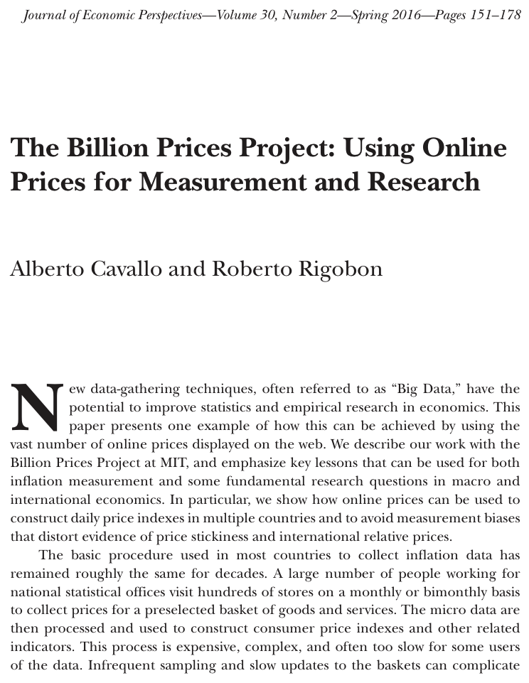
</div>
]

.pull-right[
<div align="center">
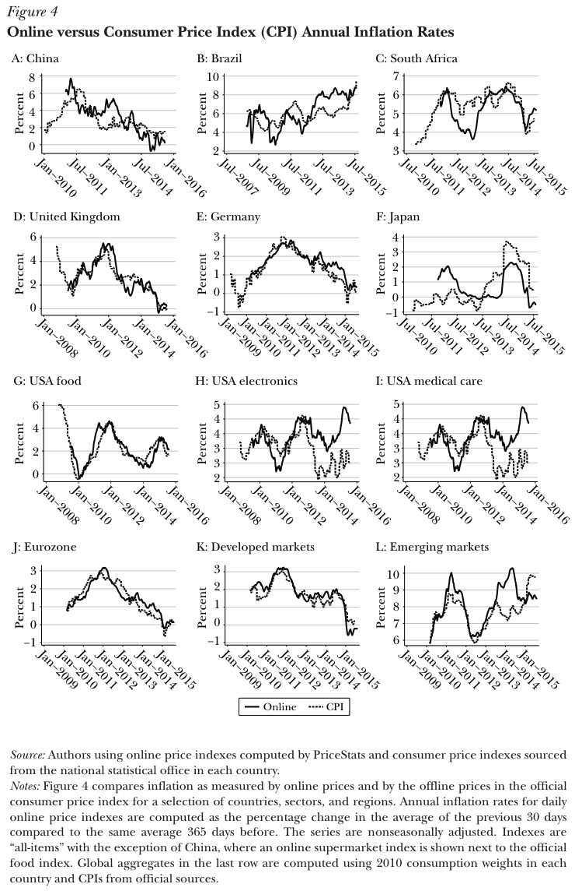
</div>
]

<br>
**See also:** [https://thebillionpricesproject.com/](https://thebillionpricesproject.com/) and [https://www.pricestats.com/](https://www.pricestats.com/)

---
# The MIT Billion Prices Project

.pull-left[
<div align="center">

</div>
]

.pull-right[
<div align="center">
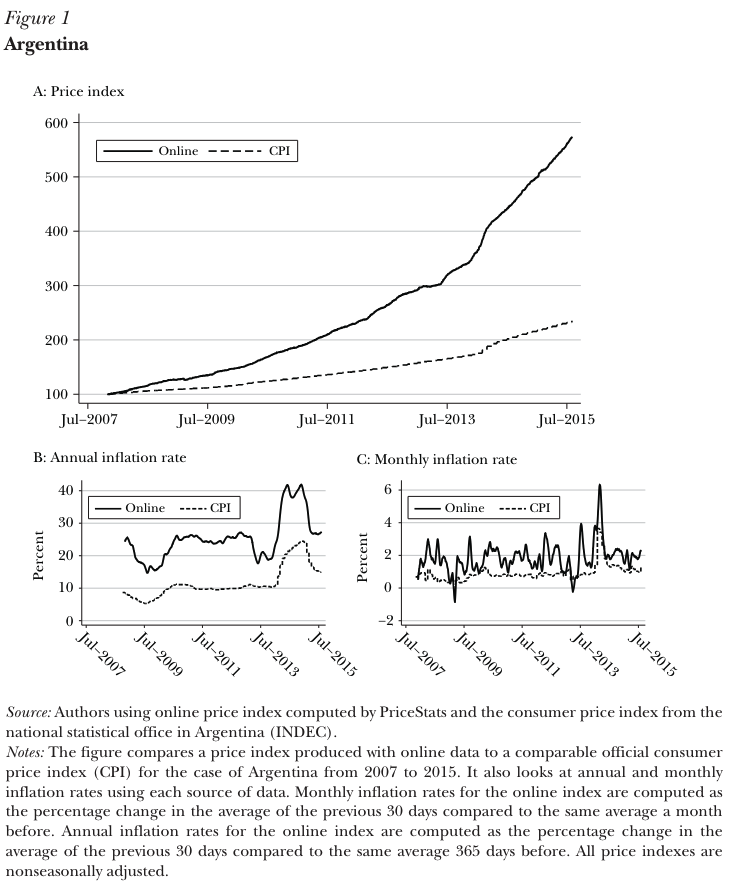
</div>
]

<br>
**See also:** [https://thebillionpricesproject.com/](https://thebillionpricesproject.com/) and [https://www.pricestats.com/](https://www.pricestats.com/)


---
# The COMPAS algorithm to predict criminals' recidivism

.pull-left[
## Background

- Correctional Offender Management Profiling for Alternative Sanctions (COMPAS) is a decision support tool developed by Northpointe (now Equivant) used by U.S. courts to **assess the likelihood of recidivism**
- Produced several scales (Pretrial release risk, General recidivism, Violent recidivism) based on factors such as age, criminal history, and substance abuse
- The algorithm is proprietary and its inner workings are not public

<br>

`Source` [Practitioner's Guide to COMPAS Core](https://s3.documentcloud.org/documents/2840784/Practitioner-s-Guide-to-COMPAS-Core.pdf)
]

.pull-right[
<div align="center">

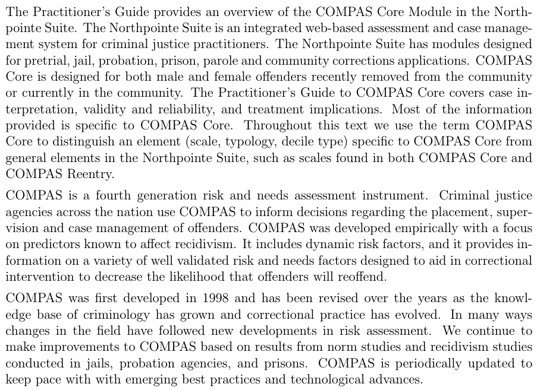
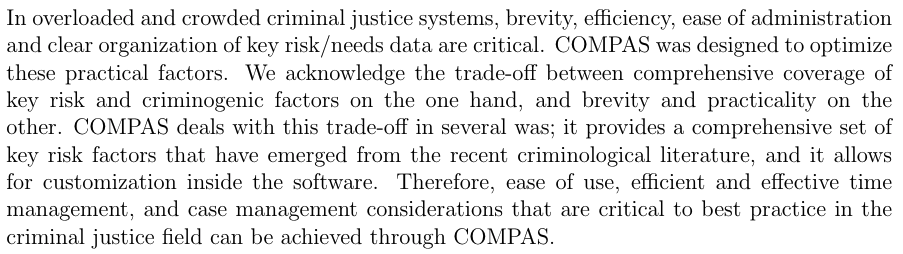
</div>
]


---
# The COMPAS algorithm to predict criminals' recidivism

.pull-left[
## The ProPublica and other investigations

- In 2016, ProPublica published an investigation showing that COMPAS was **biased against African Americans**
- **Bias:** The algorithm was more likely for African Americans to wrongly predict that defendants would re-offend.
- **Accuracy:** only 20% of people predicted to commit violent crimes actually went on to do so (in a later study estimated with 65%, still worse than a group of humans with little expertise)

<br><br><br>
`Source` [ProPublica 2016](https://www.propublica.org/article/how-we-analyzed-the-compas-recidivism-algorithm)
]

.pull-right[
<div align="center">
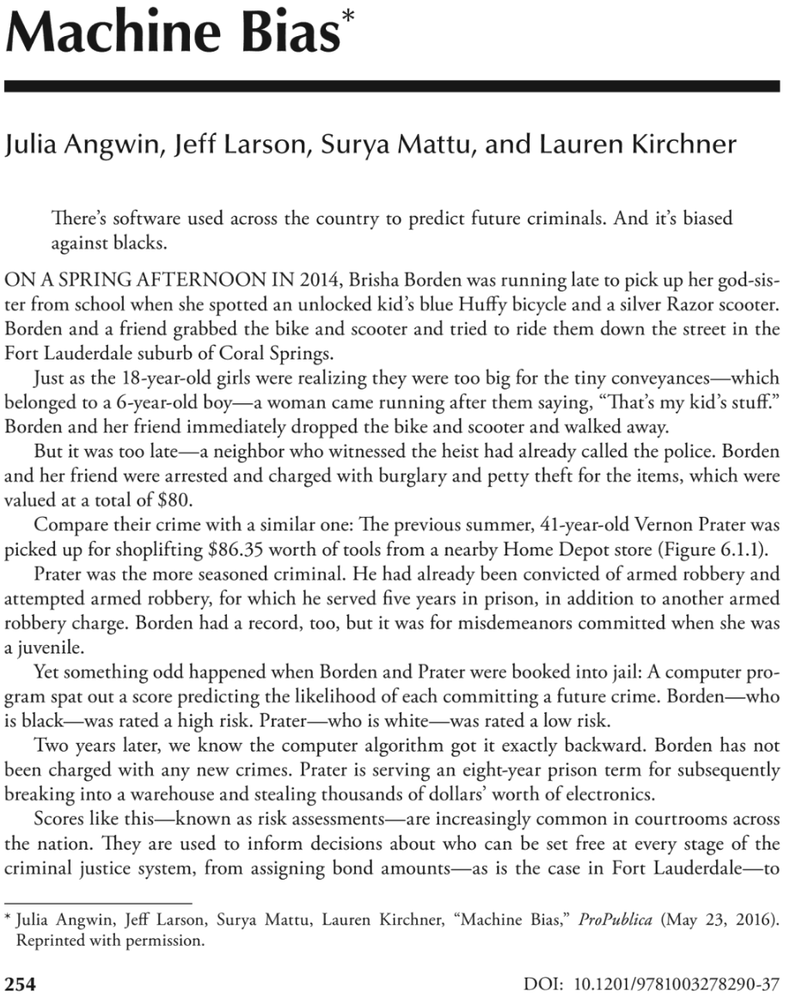
</div>
]


---
# The COMPAS algorithm to predict criminals' recidivism

.pull-left[
## The ProPublica and other investigations

- In 2016, ProPublica published an investigation showing that COMPAS was **biased against African Americans**
- **Bias:** The algorithm was more likely for African Americans to wrongly predict that defendants would re-offend.
- **Accuracy:** only 20% of people predicted to commit violent crimes actually went on to do so (in a later study estimated with 65%, still worse than a group of humans with little expertise)

<br><br><br><br>

`Source` [Dressel and Fair, 2018, Science Advances](https://www.science.org/doi/epdf/10.1126/sciadv.aao5580)
]

.pull-right[
<div align="center">
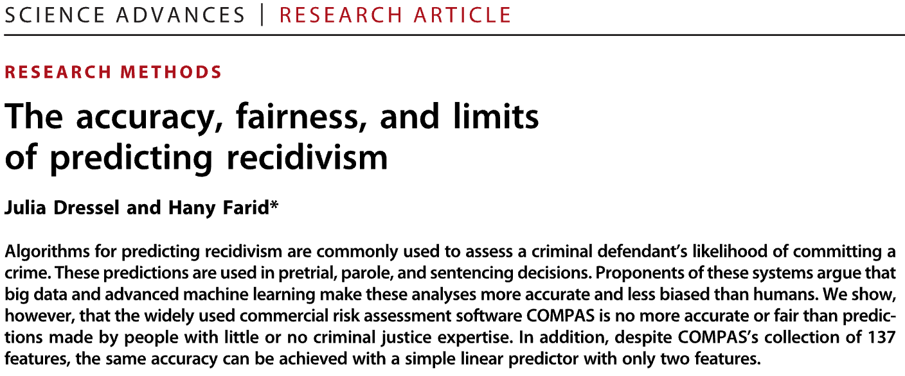
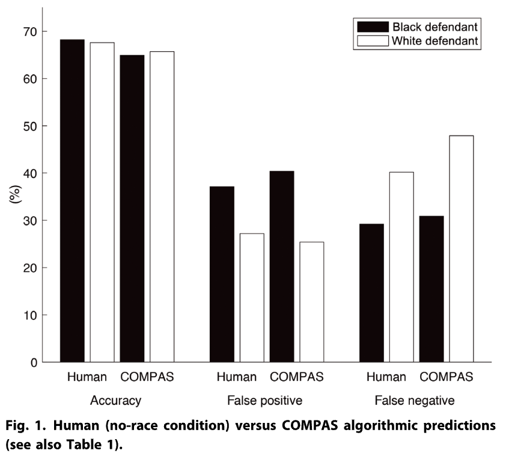
</div>
]


---
# The Meta US 2020 Election study

.pull-left-center[
<div align="center">
<br><br>
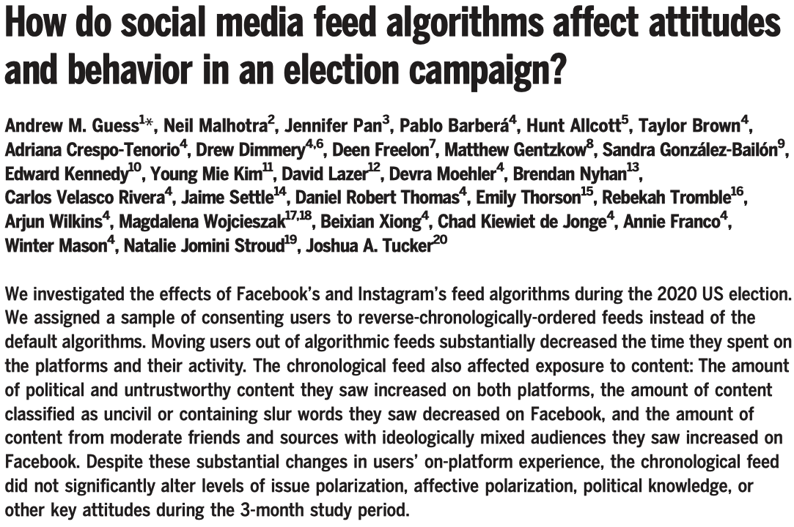
</div>
]

.pull-right-center[
<div align="center">
<br><br>
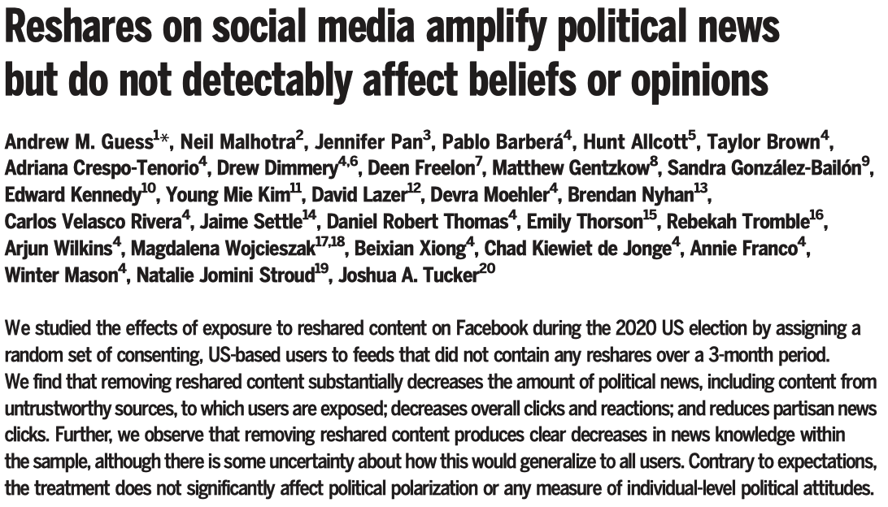
</div>
]

---
# The Meta US 2020 Election study

.pull-left[
<br><br><br><br><br><br><br><br><br><br><br><br><br><br><br><br>
`Source` [Guess et al. 2023, Science](https://www.science.org/doi/epdf/10.1126/science.abp9364)
]

.pull-right[
<div align="center">
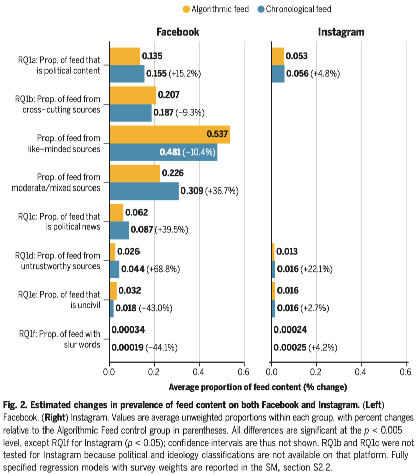
</div>
]


---
# The Meta US 2020 Election study

.pull-left-small[
<br><br><br><br><br><br><br><br><br><br><br><br><br><br><br><br>
`Source` [Guess et al. 2023, Science](https://www.science.org/doi/epdf/10.1126/science.abp9364)
]

.pull-right-wide[
<div align="center">
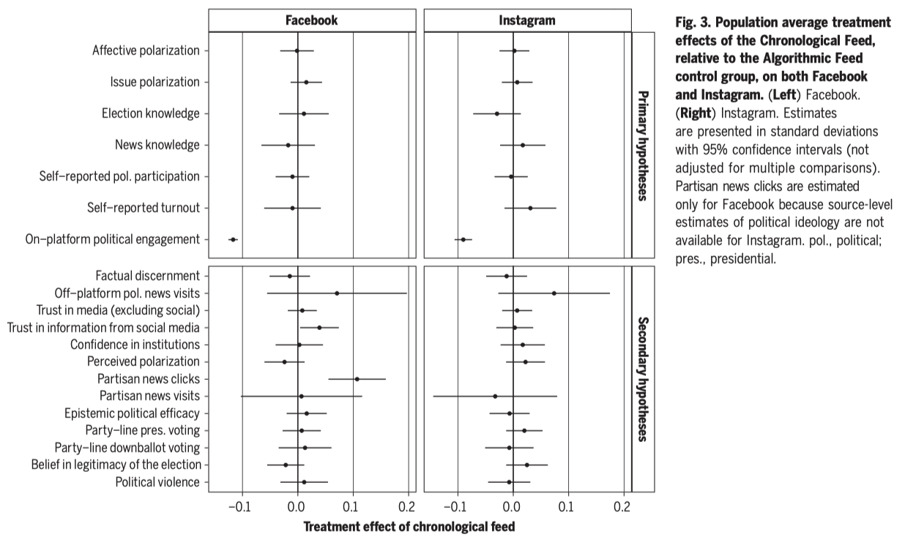
</div>
]


---
class: inverse, center, middle
name: logistics

# Class logistics
<html><div style='float:left'></div><hr color='#EB811B' size=1px style="width:1000px; margin:auto;"/></html>


---

# Introduction to Data Science in a nutshell

<div align="center">
<br>
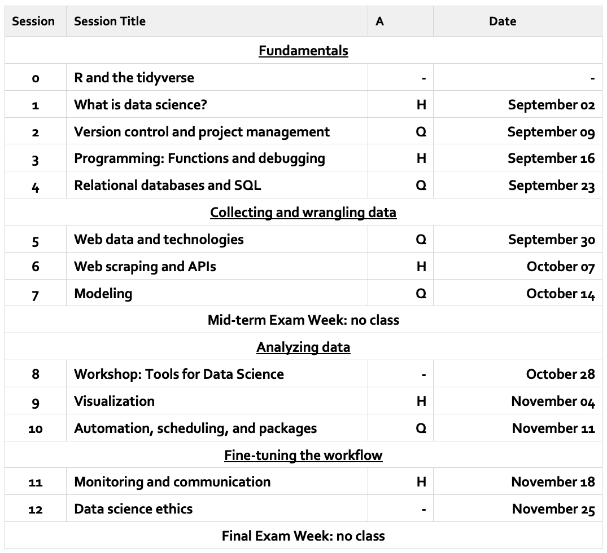
</div>


---
# The plan

.pull-left[

### Goals of the course

- This course equips you with conceptual knowledge about the data science pipeline and coding workflow, data structures, and data wrangling.
- It enables you to apply this knowledge with statistical software.
- It prepares you for our other core courses and electives as well as the master’s thesis.

<div align="center">

</div>

]

--

.pull-right[
### What we will cover

- Version control and project management
- R and the tidyverse
- Programming workflow: debugging, automation, packaging
- Relational databases and SQL
- Web data and technologies
- Model fitting and evaluation
- Viusalization
- Monitoring and communication
- Data science ethics
- (The command line)

]


---
background-image: url("pics/harry-ron-hermione-start.jpeg")
background-size: contain
background-color: #000000

# You at the beginning of the course


---
background-image: url("pics/harry-ron-hermione-end.jpeg")
background-size: contain
background-color: #000000

# You at the end of the course


---
class: center
background-color: #fff

# Why R?

<div align="center">
<br>

</div>


---

# Why R and RStudio?

### Data science positivism

- Alongside Python, R has become the *de facto* language for data science.
  - See: [*The Impressive Growth of R*](https://stackoverflow.blog/2017/10/10/impressive-growth-r/), [*The Popularity of Data Science Software*](http://r4stats.com/articles/popularity/)
- Open-source (free!) with a global user-base spanning academia and industry.
  - "Do you want to be a profit source or a cost center?"

--

### Bridge to multiple other programming environments, with statistics at heart

- Already has all of the statistics support, and is amazingly adaptable as a “glue” language to other
programming languages and APIs.
- The RStudio IDE and ecosystem allow for further, seemless integration.

--

### Path dependency

- It's also the language that I know best.
- (Learning multiple languages is a good idea, though.)


---
# Why R and RStudio? (cont.)

```{R, indeeddotcom, echo = F, fig.height = 7, fig.width = 11, dev = "svg", warning = F}
# The popularity data
pop_df = 
  data.frame(
  lang = c("Python", "SQL", "R", "SAS", "Matlab", "Julia", "SPSS", "Stata"),
  #n_jobs = c(6850, 6136, 4384, 551, 537, 249, 110, 60), # 2024/09/01 -> not possible anymore - they don't provide precise numbers!
  n_jobs = c(6850, 6136, 4384, 551, 537, 249, 110, 60), # 2023/09/01
  #n_jobs = c(12203, 10291, 6812, 1005, 838, 474, 296, 67), # 2022/09/03
  #n_jobs = c(8150, 7264, 3484, 950, 687, 270, 74), # 2021/08/27
  #n_jobs = c(99756, 132860, 41242, 31943, NA, 4843, 2302),
  free = c(T, T, T, F, F, T, F, F)
  )
## Plot it
pop_df %>% 
  mutate(lang = lang %>% factor(ordered = T)) %>%
  ggplot(aes(x = lang, y = n_jobs, fill = free)) +
  geom_col() +
  geom_hline(yintercept = 0) +
  aes(x = reorder(lang, -n_jobs), fill = reorder(free, -free)) +
  xlab("Statistical language") +
  scale_y_continuous(label = scales::comma) +
  ylab("Number of jobs") +
  labs(
    title = "Comparing statistical languages",
    subtitle = "Number of job postings for '<language> data' on de.indeed.com, 2023/09/01"
    ) +
  scale_fill_manual(
    "Free?",
    labels = c("True", "False"),
    values = c("#f92672", "darkslategray")
    ) +
  ggthemes::theme_pander(base_size = 17) +
  # theme_ipsum() +
  theme(legend.position = "bottom")
```


---
# Why R and RStudio? (cont.)

<div align="center">

</div>
`Credit` [Left_Ad8361/Reddit](https://www.reddit.com/r/dataisbeautiful/comments/qw1bew/oc_which_programming_language_is_required_to_land/)


---
# Core (and optional) readings

<br><br><br>
<div align="center">


</div>


---
# This semester

<div align="center">
<br>

</div>


---
# Attendance

## General rules

- You cannot miss more than two sessions. If you have to miss a session for medical reasons or personal emergencies, please **inform Examination Office** and they will inform me about your absence. There is no need to notify me in advance or ex post.
- We will check attendance on-site.
- The current **Hertie hygiene rules** apply!


---
# Office hours and advice

-  If you want to discuss content from class, please first do so in the lab sessions. 
- If you still need more feedback on course topics, use the Moodle forum.
- If you want to discuss any other matters with me, drop Alex Karras, my assistant, a message (`r fa('envelope')` [karras@hertie-school.org](mailto:karras@hertie-school.org)) and he will arrange a meeting.
- For general technical advice, the [Research Consulting Team at the Data Science Lab](https://hertie-data-science-lab.github.io/research-consulting/) is there for you.


---
# Assignments and grading

| Component                           | Weight |
|:-|-:|
| 4(5) × homework assignments (10% each) | 40% |
| 4(5) × online quizzes (5% each) | 20% |
| 1 × workshop presentation/attendance 	| 10% |
| 1 × hackathon project       | 30% |

--

### Homework assignments 
- The assignments are distributed via our own [GitHub Classroom](https://classroom.github.com/classrooms/113288608-introduction-to-data-science-fall-2024).
- Each assignment is a mix of practical problems that are to be solved with R.
- You are encouraged to collaborate, but everyone will hand in a separate solution.
- There will be 5 assignments (one every ~2 weeks; see [overview on GitHub](https://github.com/intro-to-data-science-24/assignments)) and the 4 best will contribute to the final grade.
- You'll have one week to work on each assignment (deadline: Tuesdays at 9:30am).
- You submit your solutions via GitHub.


---
# Assignments and grading

| Component                           | Weight |
|:-|-:|
| 4(5) × homework assignments (10% each) | 40% |
| 4(5) × online quizzes (5% each) | 20% |
| 1 × workshop presentation/attendance 	| 10% |
| 1 × hackathon project       | 30% |

### Homework assignments 
- Grades will be based on (1) the accuracy of your solutions and (2) the adherence of a clean and efficient coding style.
- Feedback will be verbal:
  - Excellent (95+)
  - Very good (90-94)
  - Good (85-89)
  - OK (80-84)
  - Acceptable (75-79)
  - Definitely needs improvement (below 75)


---
# Assignments and grading

| Component                           | Weight |
|:-|-:|
| 4(5) × homework assignments (10% each) | 40% |
| 4(5) × online quizzes (5% each) | 20% |
| 1 × workshop presentation/attendance 	| 10% |
| 1 × hackathon project       | 30% |

### Online quizzes
- The short online quizzes will test your knowledge about the topics covered in class.
- There will be 5 quizzes and the 4 best will contribute to the final grade.
- You'll have one week to work on each assignment (deadline: Tuesdays at 9:30am).


---
# Assignments and grading

| Component                           | Weight |
|:-|-:|
| 4(5) × homework assignments (10% each) | 40% |
| 4(5) × online quizzes (5% each) | 20% |
| 1 × workshop presentation/attendance 	| 10% |
| 1 × hackathon project       | 30% |

### Workshop presentation (MDS students)
- On October  28, 14-20h, we will flip roles and you will become instructor of a data science workshop session.
- You, in groups of 2 students, will present a data science workflow tool (randomly [allocated](https://github.com/intro-to-data-science-24/workshop-presentations)).
- Your contribution will include:
  1. A lightning talk (recorded) where you briefly introduce and motivate the tool
  2. A hands-on session where you showcase the tool and provide practice material
- Both the recorded talk and the materials will be graded.
- Check out the materials from previous workshops online [`>2021<`](https://intro-to-data-science-21-workshop.github.io/) [`>2022<`](https://intro-to-data-science-22-workshop.github.io/)
[`>2023<`](https://intro-to-data-science-23-workshop.github.io/)!
- **MPP/MIA students**: You will not give a talk, but have to actively participate in the workshop.


---
# Assignments and grading

| Component                           | Weight |
|:-|-:|
| 4(5) × homework assignments (10% each) | 40% |
| 4(5) × online quizzes (5% each) | 20% |
| 1 × workshop presentation/attendance 	| 10% |
| 1 × hackathon project       | 30% |

### Hackathon project
- On December 2, 13-16h, there will be a hackathon hosted at Hertie.
- At the hackathon itself, we introduce the data and provide an environment that should facilitate you getting started with the project and form groups of 3-4 students.
- Two weeks later, on December 16, the project instructions will be made available. You will then have 48 hours to submit your solutions.
- The task is similar to the homework assignments but puts more emphasis on creative problem-solving using the tools and techniques you have learned in class.


---
# AI use in and for the course


.pull-left-wide[

### Can AI tools (LLM interfaces, AI pair programming) be used for assignments?

- Yes, but use them with care. You will not become an efficient programmer if you heavily rely on those tools without learning the basics.
- The Hertie School has installed [teaching guidelines on the use of AI Tools](https://www.hertie-school.org/en/news/allcontent/detail/content/hertie-school-defines-guidelines-for-use-of-artificial-intelligence-software-at-university) in Spring 2023. We will stick to those guidelines.
- Some key elements from the guidelines:
  - "Familiarity with AI tools is helpful for the learning experience and the professional development of students afterwards, ..."
  - "... but needs to be done with clear guidelines on ethical use, biases, and limits of the tools that are currently available."
  - "[T]he use of AI tools for the preparation of assignments (...) needs to be clearly referenced in the text."
  
]

.pull-right-small-center[
<div align="center">
<br>

<br>
<br>

</div>
]


---
# Further reading

<div align="center">


<br>
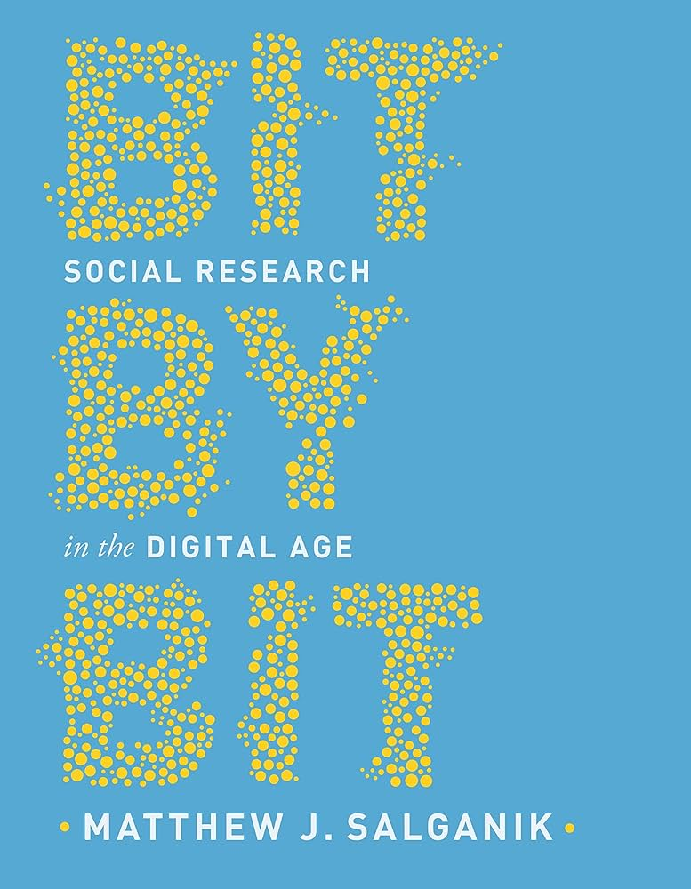

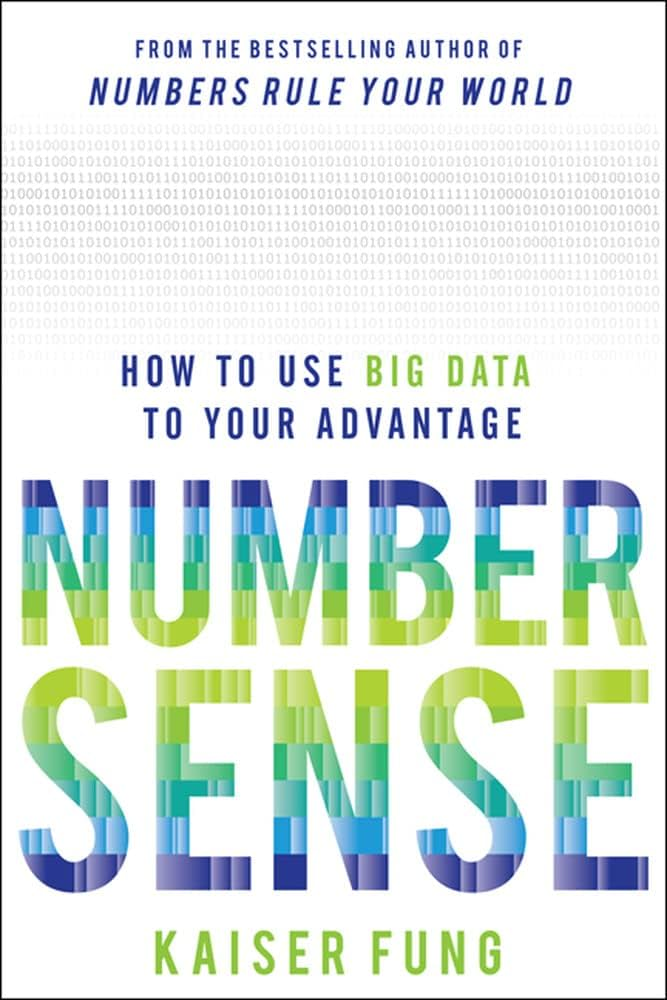
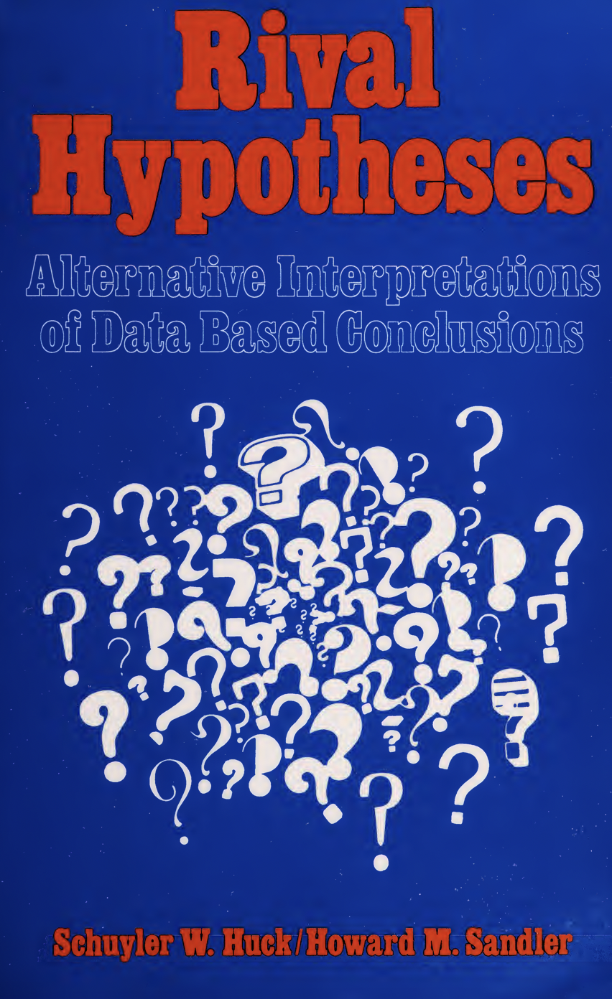
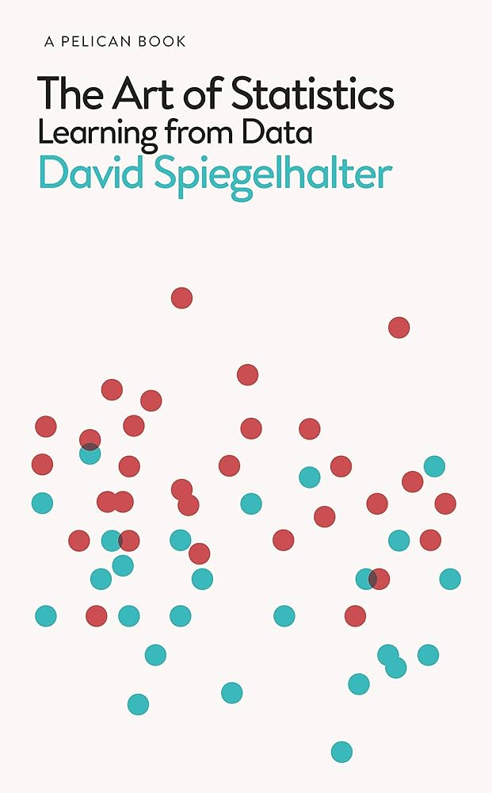
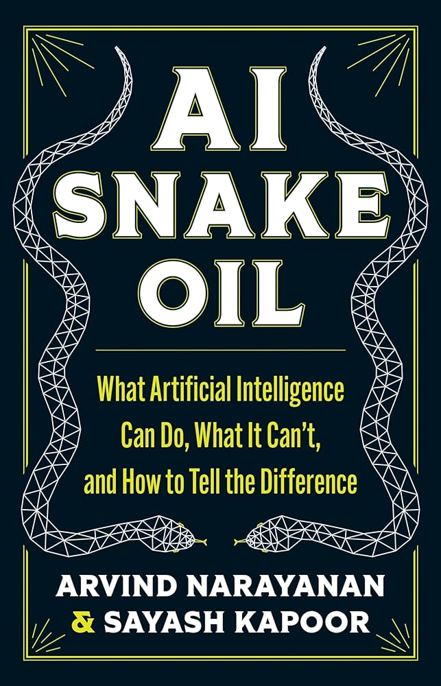
</div>


---
# Further listening

<div align="center">
<br><br><br>

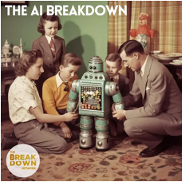
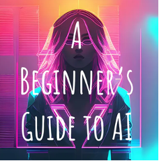
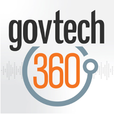


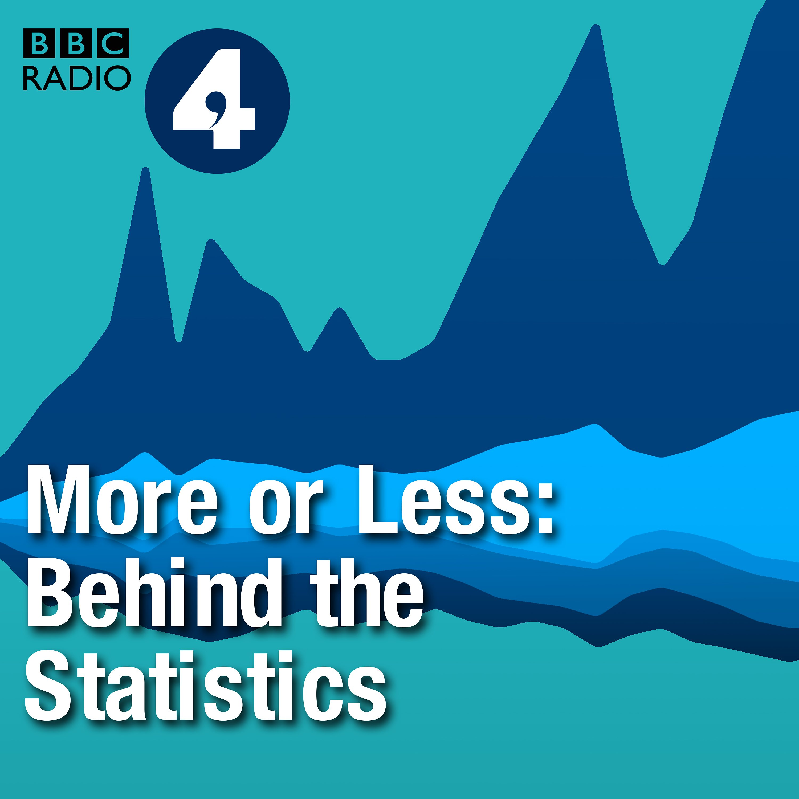
<br>


</div>


---
# Further watching

<div align="center">
<br><br><br><br><br>


</div>


---
# Coming up

<br><br><br> 

### The first lab session

Get to know Carmen, Sebastian, R, and RStudio, four of your best friends for the next months!

### Next lecture

Version control and project management


